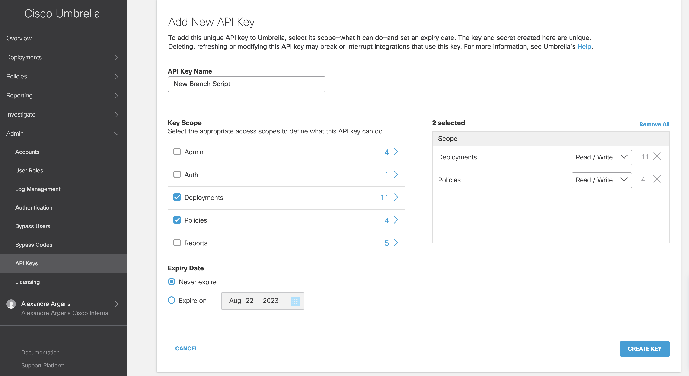

# Cisco Umbrella DNS new branch orchestration deployment

Use cases :

This Python script automates the creation of new sites and identities. It reads entries from the Excel file, extracting relevant information to generate sites, identities and links these identities to policies, ensuring proper access control. This script simplifies the process of site creation, identity generation, and policy linkage, streamlining operations and saving valuable time.

## Create a Cisco Umbrella API key

## Create a Excel sheet from this template

